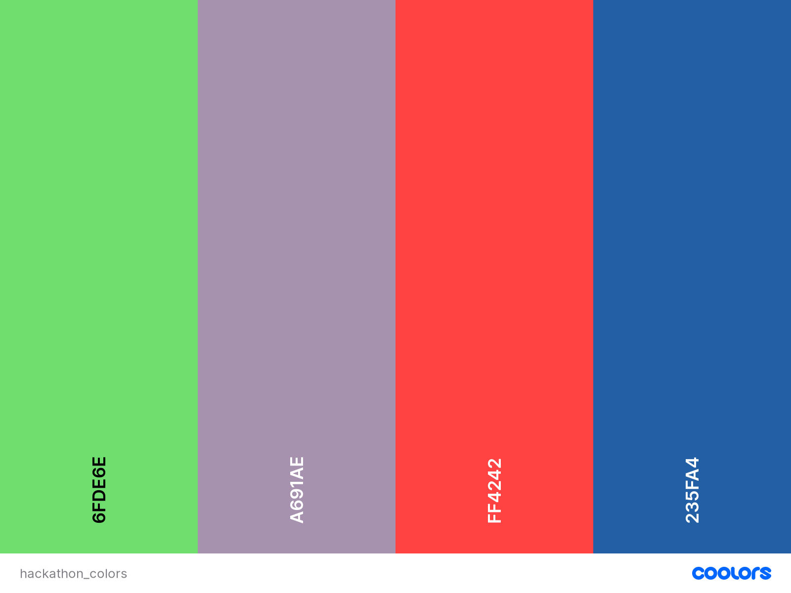

# Diverspect

## Table of Contents
- [Diverspect](#diverspect)
	- [Table of Contents](#table-of-contents)
	- [Introduction](#introduction)
	- [UX](#ux)
		- [**Overview**](#overview)
		- [**Why Diverspect?**](#why-diverspect)
		- [Goals](#goals)
		- [Wireframes -](#wireframes--)
		- [Design](#design)
			- [Design Process](#design-process)
		- [Colour Pallette](#colour-pallette)
		- [Font](#font)
	- [User Stories](#user-stories)
		- [Target Audience](#target-audience)
		- [As a Site User I want to...](#as-a-site-user-i-want-to)
		- [As a Site Superuser](#as-a-site-superuser)
		- [As a Developer](#as-a-developer)
	- [Features](#features)
		- [Existing Features](#existing-features)
		- [Future Features](#future-features)
			- [Features Visiable across All Pages](#features-visiable-across-all-pages)
			- [Features Visiable on each page](#features-visiable-on-each-page)
		- [Features left to Implement](#features-left-to-implement)
		- [Bugs and Fixes Implemented after Testing](#bugs-and-fixes-implemented-after-testing)
	- [Technologies Used](#technologies-used)
		- [Backend Technologies](#backend-technologies)
		- [Languages](#languages)
		- [Libraries](#libraries)
		- [API's](#apis)
		- [Databases](#databases)
		- [Tools](#tools)
	- [Testing](#testing)
		- [Validation of Code Testing](#validation-of-code-testing)
			- [HTML](#html)
			- [CSS](#css)
			- [Javascript](#javascript)
			- [Python](#python)
	- [Deployment](#deployment)
		- [Used Commands during Deployment](#used-commands-during-deployment)
		- [Hosting on Heroku](#hosting-on-heroku)
		- [Forking the GitHub Repository](#forking-the-github-repository)
		- [Running this Project Locally](#running-this-project-locally)
	- [Credits](#credits)
		- [Content](#content)
		- [Media](#media)
		- [Acknowledgements](#acknowledgements)
	- [Disclaimer](#disclaimer)
			- [This website was made for educational purposes only](#this-website-was-made-for-educational-purposes-only)

## Introduction

This site was created as part of a hackathon programme organised by Code Institute in collaboration with Trust in SODA.

The goal of this site is to give users the ability to talk about their troubles with inclusivity in the workplace, online and in their general lives. This will hopefully open up a healthy discussion between everyone and open up peoples eyes about how people with disabilities, or even just other inclusivity problems. Other inclusivity problems could be mothers returning to work after having a baby. They may be anxious to return to the work environment. And hopefully this site will give everyone the chance to talk about their respective problems and open up a discussion between everyone and businesses.

-----

## UX

### **Overview**
Diverspect is an online forum where users can provide feedback and suggestions to companies to make the workplace more accessible. It can be a forum for people from all walks of life in any industry where they need their voice heard about what can be done to improve inclusivity in the workplace. User can sign up for an account, post a comment, edit and delete their comments and read comments added by other users.

### **Why Diverspect?**

The project name Diverspect came from a blended word Diverspection (diverse + perspective), which documents a different approach to understanding and dealing with complexity in psychosocial environments. The approach is based on abandoning the traditional view on roles and processes in organizations.

### Goals

As a site owner, we would like to provide a safe online space for users to share information and express their voices relating the challenges they encounter in their workplaces.  

We aim to highlight the issues expressed on our site to companies. We hope that companies then make better educated decisions to improve their inclusive work space.

As a site owner, we would like to provide a safe online space for users to share information and express their voices relating the challenges they encounter in their workplaces.  

We aim to highlight the issues expressed on our site to companies. We hope that companies then make better educated decisions to improve their inclusive work space.


### Wireframes -
We have produced a mock up of the websites pages.

Wireframes created can be found [HERE](./WIREFRAMES.md)

-----

### Design

#### Design Process

1. _Strategy Plane_
   
   **User Stories**
   This site is created based on the following user’s expectations in mind.

   * As a first time user I would like to:
     
	 * Have a clear information on what the site is about and what it provides
	 * Have an easy navigation that is consistent throughout the website
	 * Consistent layout without any confusing elements
	 * Some control to improve the site experience for visually impaired 
	 * Accessibility considerations are taken throughout the site
	 * Have an easy and safe sign-up option
	 * Have a safe space to share information or express opinions
	 * Have a control to edit and delete the post I have entered on the site but nobody else should be allowed to modify my post
	 * Have clear feedback for my action taken within the site 
	 * Search the post to find relevance information to my needs
	 * Follow the relevant post or user 
	 * Option to opt out

    * A returning user would like to have the following in addition to the above:
	  
	  * Quick login option
	  * Searching the post by categories to find relevant information quickly
	  * Ability to quickly check the response to my post

	* As a site creator we would like :

	  * To provide safe and friendly site that anyone can gain and share information in order to tackle their everyday challenge at their workplace
	  * To promote diversity and inclusion
	  * To promote awareness of everyday accessibility issues in the workplace
	  * To provide safe and friendly site that any people can gain and share information in order to tackle their everyday challenge at their workplace
	  * To promote diversity and inclusion
	  

2. _Scope Plane_

	**Features**
	
	 * The site should be responsive and user-friendly on all browsers and devices.
	 * Intuitive and user-friendly site that any people can gain and share experiences.
	 * intuitive and user-friendly layout.
	 * The purpose of the site should be clear immediately.
	 * Users should be able to easily register/login/logout.
	 * Users should be able to add/edit/remove comments in the forum page.

3. _Structure Plane_

	**User Story:**

	> - As a first time visitor to the site I would like to immediately understand it's purpose.

	**Acceptance Criteria:**

	* The home page has a heading that discribes the purpose of the site and who it is for.

	**Implementation:**

	The home page will display a heading that clearly shows the site purpose.

	**Result:** User Story accomplished.

	**User Stories:**

	> - I would like to be able to register on the site.
	> - Upon the registration, I would like to receive a confirmation email.
	> - I would like to be able to login/logout of the site.

	**Acceptance Criteria:**

	* User can access a registration form page and enter their details.
	* User receives an email confirming their sign up.
	* User can login of the site.
	* User can logout of the site.

	**Implementation:**

	There is an icon in the top right corner of the page where the user can register/login for unauthenticate users and a logout icon is displayed for authenticated users. Furthermore, users will receive an email after registration.

	**Result:** User Story accomplished.

- _Database Structure_ 

4. _Skeleton Plane_

	**Navigation:** Browsing

	* Click on the profile icon to navigate to their account
	* There will be a back to top button to help users navigate to the top of the page with a single click

	**Navigation:** Searching

	* Users can use search through all the forms by just typing in some keywords. An example would be the user wanting to find a forum that talked about blindess. All the user needs to do is search terms such as, "blind", "blindess", "visually impaired" etc.


	**Features**

	*   Responsive on all device sizes.

	*   Interactive elements.

	**Existing Features** 

	* Sign Up to open an account
	* Login for users who already have an account
	* View and edit account details
	* View all other users posts and comments on the home page
	* Individual users can create their own posts to talk about their own issues
	* Individual users can also edit and delete their own posts and comments 

	**Future Features**

	* Text-to-Speech API. This will help many users who may struggle with reading on an electronic devices or for visually impaired users. This feature will read out what the other user has posted.
	* Text Enlarger. This will enlarge text for users who may struggle with reading on electronic devices and are unable to use the text-to-speech feature. Users who having hearing problems and having poor vision can benefit from this feature as the text will become much larger.
	* Change Backgrounds. This option will allow users with dyslexia to pick a background colour that is more suitable for them. 


5. _Surface Plane_

	**Colour Pallette**

	

	* For the colours we used [Inclusive Color Palettes for the Web](https://medium.com/cafe-pixo/inclusive-color-palettes-for-the-web-bbfe8cf2410e). This site gave us several colours and colour palettes to look at which are inclusive for all users. These colours are user friendly for visually impaired and do not ruin the experience for users that are not visually impaired

	**Font**

	* Google Fonts was used to import the fonts Quicksand & Montserrat into the base.css file. These fonts were used throughout the site.

[Back to top ⇧](#diverspect)

-----

## User Stories

### Target Audience
1. People with disabilities wishing to share their experiences of how their disabilities impact their online usage. Such as sites catering to their disabilities, or how workplaces help with their disabilities
1. Helping the general public share their everyday experiences of how their life is impacted by the lack of inclusivity in the workplace and online.

### As a Site User I want to...

1. Be able to leave a comment on someone elses post, to help share my thoughts on the post and maybe offer some advice to the other user
1. Create my own account that stores my information so that I am able to make my own posts and leave comments on other users posts
1. Be able to browse all the posts from other users
1. Be able to edit any of the posts or comments that I leave on the site.
1. Be able to delete any of the posts or comments that I leave on the site.

### As a Site Superuser

### As a Developer

[Back to top ⇧](#diverspect)

-----

#### Features Visiable across All Pages

* Navbar: Diverspect logo, search box, profile button to log in and sign up, as well as view profile once logged in

#### Features Visiable on each pages:

_Home Page_

* All forums will be displayed below the navbar.
* Bottom right hand side of the page will have a button for the user to click that will take them back to the top of the page

_Account Page_

* Edit users details such as their username or email.

_Log in and Sign up Pages_

* These two pages will have a form for the user to fill out
* Log In: For the log in form the user will need to put their email/username and then a password to get into their account
* Sign Up: The user will need to put an email, username, a password, they will then also need to confirm their password. They can then create their account once all these fields are completed properly.

_Edit Comment Page_

* Once a user has created an account and logged in, any comments they make they can then edit. When editting a comment, a form will show up. It'll have the original comment the user made, the user can then click on this section of the form and edit the writing. They can then click save to submit their editted comment.

_Create Forum Page_

* This page will be a form with several sections. It will have a title and a desctiption section. The user will give their forum a title and then in the description section they can describe their inclusivity or disability problem that they wish to share.

### Features left to Implement

* Follow a forum. This feature gives a user the ability to follow a specific forum that they have an interest in.
* Once a user has followed a forum, they will then be able to view all their followed forums in their account page.
* User can edit their profile information. They can change their username, email address and their pronouns preferences
* Help button in navbar. This button would take the user to a FAQ page, with the hope of answering any of the queries the user has.

### Bugs and Fixes Implemented after Testing

[Back to top ⇧](#diverspect)

-----

## Technologies Used

### Backend Technologies

1. **Gunicorn 20.0.4:** Gunicorn ‘Green Unicorn’ is a Python WSGI HTTP Server for UNIX. The Gunicorn server is broadly compatible with 
various web frameworks, simply implemented, light on server resources, and fairly speedy. https://docs.gunicorn.org/en/stable/

2. **Pillow 4.3.0:** The Python Imaging Library adds image processing capabilities to your Python interpreter. This library provides
extensive file format support, an efficient internal representation, and fairly powerful image processing capabilities. 
https://pillow.readthedocs.io/en/stable/handbook/overview.html

3. **Psycopg2 2.8.5:** Psycopg is the most popular PostgreSQL database adapter for the Python programming language. Its main features are 
the complete implementation of the Python DB API 2.0 specification and the thread safety. https://pypi.org/project/psycopg2/ 

4. **boto3 1.14.5:** Boto is the Amazon Web Services (AWS) SDK for Python. It enables Python developers to create, configure, and manage AWS 
services, such as EC2 and S3. https://boto3.amazonaws.com/v1/documentation/api/latest/index.html

-----

### Languages

1. **HTML5, or Hyper Text Markup Language:** Used to construct the page within this app -   
https://developer.mozilla.org/en-US/docs/Web/HTML

2. **CSS3, or Cascading Style Sheets:** Used to style the various elements on the app's pages via coloring, fonts, spacing, etc. - 
https://www.w3.org/Style/CSS/Overview.en.html

3. **Javascript:** A programming language - https://www.javascript.com/

4. **JQuery:** A programming language - https://jquery.com/

5. **Python3:** A programming language - https://www.python.org/

6. **Jinja:** A programming language - https://jinja.palletsprojects.com/

7. **Bson and Json:**  A computer data interchange format - https://www.mongodb.com/json-and-bson

-----

### Libraries

### API's

1. **Django:** A web framework - https://www.djangoproject.com/

### Databases

1. **Postgres:** Open Source Database - https://www.postgresql.org/

2. **sqLite3:** SQL Database Engine - https://www.sqlite.org/

-----

### Tools

1. **Gitpod:** An online IDE also used for creating & saving code that runs in a browser, it does not have to be installed on your PC - 
https://www.gitpod.io/

2. **Git:** A version control system for tracking changes in source code during software development - https://git-scm.com/

3. **Github:** A company that provides hosting for software development version control using Git. It is a subsidiary of Microsoft - https://github

4. **Heroku:** An application platform. allowing users to build, run and operate applications - https://www.heroku.com

5. **Django Secret Key Generator:** Generates Django secret keys - https://miniwebtool.com/django-secret-key-generator/

6. **Chrome DevTools:** A set of web developer tools built directly into the Google Chrome browser. I used these tools constantly thoughout the development cycle -
   https://developers.google.com/web/tools/chrome-devtools

7. **W3C Markup Validation Service:** Used to run all html and css code through a validation process looking for errors - https://validator.w3.org/
   https://jigsaw.w3.org/css-validator/validator

8. **Pep8:** Python Validator used to run all python code through to look for errors -  http://pep8online.com/

9. **JSHint:** Javascript Validator used to run all JS code through looking for errors - https://jshint.com/

10. **Free Formatter:** A HTML formatter that Formatted my HTML 2 spaces per indent - https://www.freeformatter.com/

[Back to top ⇧](#diverspect)

-----

## Testing

We carried out substantial testing on the websites pages and links. You can see the results of the tests [here](./TESTING.md)

### Validation of Code Testing

#### HTML

All Pages tested using [W3C](https://validator.w3.org/nu/) HTML Validator.

#### CSS

All Pages tested using [W3C](https://jigsaw.w3.org/css-validator/) CSS Validator.

#### Javascript

All JS and JQuery tested using [JSHint](https://jshint.com/) Javascript Validator.

#### Python

All Python tested using [PEP8](http://pep8online.com/) Python Validator.

> Note: ``` python3 -m flake8 ``` was run and all the errors and warnings associated with my own code, were fixed.
Line to long errors within the code generated by Django and code from the migrations were left as developers shouldn't need to touch them.
Errors left within our own code are - 

-----

## Deployment

This website was developed in Gitpod and pushed to the remote repositories, GitHub and Heroku. The live page is hosted on Heroku.

### Used Commands during Deployment

1. git add . - To add files to staging area.

2. git commit -m "message here" - To commit the files.

3. git push - To push the committed files to the origin master branch on github.

4. git push heroku master - To push the commited files to the origin master branch on heroku.

5. git status - To see the current state of the files.

6. python3 manage.py migrate - Runs migrations.

7. python3 manage.py create superuser - Creates Superuser.

8. python3 manage.py dumpdata - To create json data files.

9. export DATABASE_URL= "your value from heroku" - To connect Gitpod to Postgres.

10. python3 manage.py loaddata - Loads the dumps into Postgres.

### Hosting on Heroku

In order to successfully deploy the app, the following steps were taken:

1. Log into your Heroku account, create new app.

2. Choose app name and closest region.

3. On Resources tab, provision Heroku Postgres.
	 
4. Back in gitpod, install the following via these commands:
	- ```pip3 install dj database url```
	- ```pip3 install psycopg2 binary```

5. Freeze the requirements to update the requirements.txt file. This makes sure Heroku installs all apps when deployed:
	- ```pip3 freeze > requirements.txt```

6. To get the database setup, go to settings.py and import dj_database_url.

7. In databases settings, comment out default configuration and replace the default database with a call to dj_database_url.parse, and give it the database URL from Heroku stored in your config variables (under the app settings tab).

8. Now run all migrations with:
    - ```python 3 manage.py migrate```

9. Then create a superuser with:
	- ```python3 manage.py create superuser```

10.	Back in settings.py remove the Heroku database config, and uncomment the original so our database URL doesn't end up in version control.

11.	Then commit to github.

12.	Using an if statement in settings.py, to allow access to Postgres when running on Heroku, where database URL environment variable is defined, otherwise connecting to sqlite. 

13. Install unicorn, which will act as our webserver, then freeze that into requirements.txt:
	- ```pip3 install gunicorn```
	- ```pip3 freeze > requirements.txt```

14.	Create Procfile, enter the following to tell Heroku to create a web dyno, which will run unicorn and serve our django app:
	- ```web: gunicorn APP_NAME.wsgi:application```

15. Temporarily disable collectstatic. 

16.	Add the hostname of our Heroku app to allowed hosts in settings.py, and localhost:
	- ```ALLOWED_HOSTS = ['YOUR-APP-NAME.herokuapp.com', 'localhost']```

17.	Add/commit changes to github.

18.	To deploy to Heroku, enter (you may need to initialize your Heroku git remote if you created your app on the website rather than the CLI):
    - ```git push heroku master```

19.	To automatically deploy on Heroku when committing to github - on your Heroku dashboard go to Deploy > Github, search for your repository and click Connect.

20.	Click Enable Automatic Deploys.

21.	Add a new secret key in your Heroku Config Vars (you can use an online Django secret key generator to do this). 

22.	Now you can replace the secret key in settings.py with a call to get this from the environment.

23.	Commit/push these changes to github.

-----

### Forking the GitHub Repository

By forking the GitHub Repository we make a copy of the original repository on our GitHub account to view and/or make changes without affecting the original 
repository by using the following steps...

1. Log in to GitHub and locate the [GitHub Repository](https://github.com/)

2. At the top of the Repository (not top of page) just above the "Settings" Button on the menu, locate the "Fork" Button.

3. You should now have a copy of the original repository in your GitHub account.

### Running this Project Locally

You will need to install the following to run this locally:

- An IDE 
- Python3 to run the application
- PIP to install all app requirements
- Django
- SQlite or Postgres Databases
- GIT for cloning and version control

To run this code on your local machine, you would go to my respository at
https://github.com/Gwen-Bradbury/trust-in-soda-hackathon and on the home page on the right hand side just above all the files, you will see a green button that says,
"Clone or download", this button will give you options to clone with HTTPS, open in desktop or download as a zip file.
To continue with cloning, you would;

- Open Git Bash
- Change the current working directory to the location where you want the cloned directory to be made.
- Type git clone, and then paste this URL; https://github.com/Gwen-Bradbury/trust-in-soda-hackathon.git Press Enter. Your local clone will be created.

For more information about the above process; https://help.github.com/en/github/creating-cloning-and-archiving-repositories/cloning-a-repository

[Back to top ⇧](#diverspect)

-----

## Credits

### Content

1. Colour Scheme

2. Wireframes

3. Data Schema

### Media

1. Table of contents

4. Tutorial Videos

- [Code-Institute](https://codeinstitute.net/)

### Acknowledgements

## Disclaimer

#### This website was made for educational purposes only
